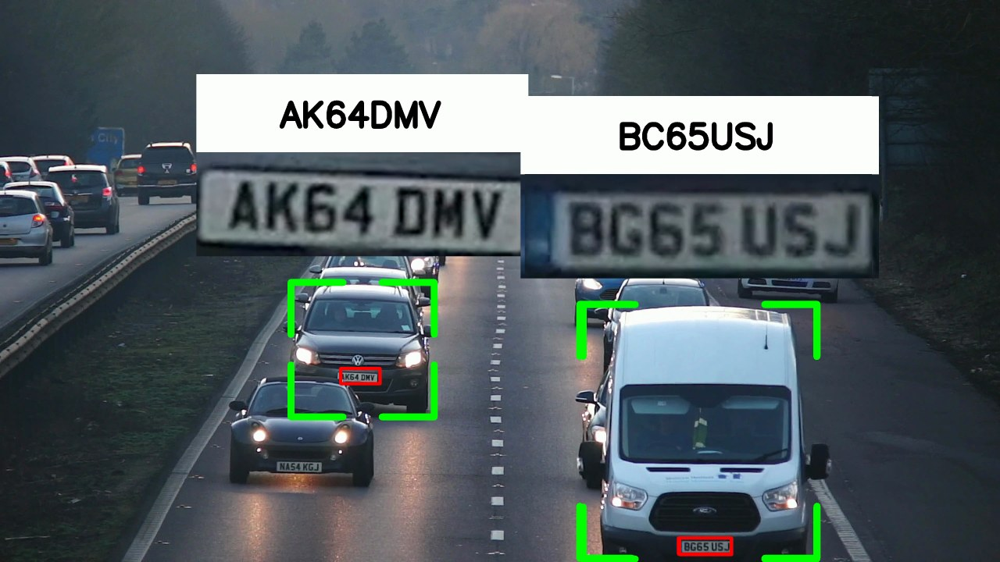
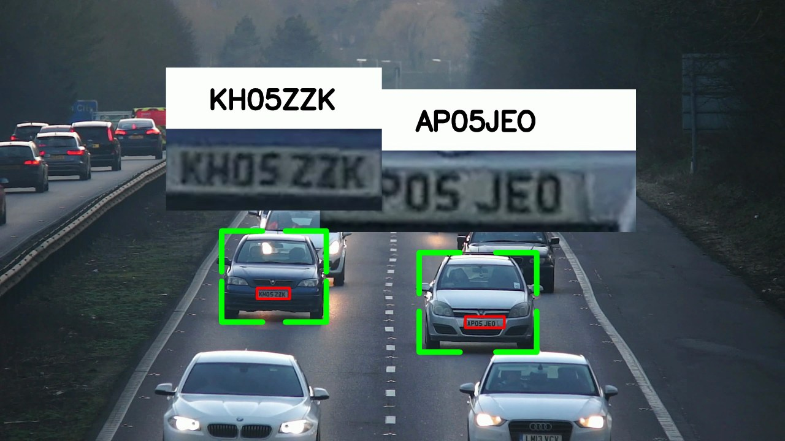
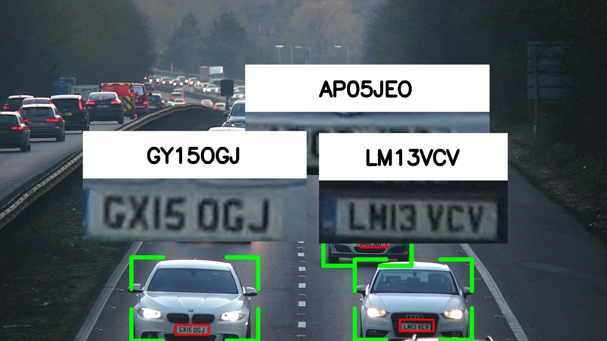

# Vehicle License Plate Recognition

A computer vision project for detecting vehicles, locating license plates, reading plate text with OCR, and generating an annotated output video.

The pipeline combines YOLO-based object detection, vehicle tracking, EasyOCR, and frame interpolation to produce readable license plate results across video frames.

## Example Output

Frames from `Output/out.mp4`. Each tracked vehicle gets a green corner box, its plate
is outlined in red, and a cropped preview of the plate is pinned above the car with the
OCR reading printed over it.







The readings are not perfect, and the crops make that easy to check by eye: in the first
frame the van's plate is read as `BC65USJ` where the crop shows `BG65USJ`, and in the
third `GX15OGJ` is read as `GY15OGJ`. Characters are recovered from heavily downscaled,
motion-blurred regions, so confusions between visually similar glyphs are expected.

## What It Does

- Detects vehicles in traffic video using YOLOv8
- Detects license plates using a custom trained YOLO model
- Tracks vehicles across frames with SORT
- Crops and preprocesses license plate regions for OCR
- Reads plate text using EasyOCR
- Interpolates missing bounding boxes between frames for smoother output
- Generates an annotated video with vehicle boxes, plate boxes, cropped plate previews, and recognized text

## Pipeline

| Step | Description |
| --- | --- |
| Vehicle detection | Uses `yolov8n.pt` to detect cars, motorcycles, buses, and trucks |
| License plate detection | Uses `best.pt`, a trained plate detection model, to locate plates in each frame |
| Vehicle tracking | Uses SORT to assign consistent IDs to detected vehicles across frames |
| OCR | Crops plates, converts them to grayscale, thresholds the image, and reads text with EasyOCR |
| Interpolation | Fills missing bounding boxes between frames for smoother output |
| Visualization | Draws detections and recognized plate numbers back onto the source video |

## Repository Structure

| Path | Description |
| --- | --- |
| `Input/` | Source video used for detection (Git LFS - see [Input Video](#input-video)) |
| `Output/` | Generated CSV files and final annotated video (not versioned) |
| `PretrainedModels/` | YOLO model weights: `yolov8n.pt` and `best.pt` |
| `sort/` | SORT tracking implementation |
| `OCR.ipynb` | Main detection, tracking, and OCR workflow |
| `utils.ipynb` | Bounding-box interpolation utilities |
| `DetectionsAndDisplay.ipynb` | Final video annotation and display workflow |
| `run.sh` | Runs the whole pipeline from the command line |
| `requirements.txt` | Pinned Python dependencies |
| `docs/examples/` | Sample annotated frames used in this README |

## Outputs

The project generates:

- `Output/detections.csv` with raw vehicle, plate, and OCR detections
- `Output/detections_interpolated.csv` with smoothed/interpolated detections
- `Output/out.mp4` with bounding boxes and recognized license plate text overlaid on the video (see [Example Output](#example-output))

## Tech Stack

- Python
- OpenCV
- YOLOv8 / Ultralytics
- EasyOCR
- NumPy
- Pandas
- SciPy
- SORT tracking
- Jupyter Notebook

Exact versions are pinned in `requirements.txt`.

## How to Run

### Setup

Requires Python 3.9. Create a virtual environment and install the pinned dependencies:

```bash
python3 -m venv venv
./venv/bin/pip install -r requirements.txt
```

The YOLO weights (`PretrainedModels/yolov8n.pt` and `PretrainedModels/best.pt`) are
already in the repository.

### Input Video

The sample clip (`Input/2103099-uhd_3840_2160_30fps.mp4`, 3840x2160 30fps, 175 MB) ships
with the repository via [Git LFS](https://git-lfs.github.com). **You need git-lfs
installed before cloning**, or you will get a small text pointer instead of the video:

```bash
brew install git-lfs      # macOS; see git-lfs.github.com for other platforms
git lfs install
git clone https://github.com/Atharv-02/Vehicle-License-Plate-Recognition.git
```

Already cloned without it? Run `git lfs install && git lfs pull` in the repo.

To use different footage, drop it in `Input/` and point `VIDEO_PATH` at it in both
`OCR.ipynb` and `DetectionsAndDisplay.ipynb`. Any resolution works, but plates need to be
legible enough for OCR.

### From the command line

`run.sh` runs all three stages in order and writes everything to `Output/`:

```bash
./run.sh
```

You can also run a single stage:

```bash
./run.sh ocr           # detect, track, and OCR   -> Output/detections.csv
./run.sh interpolate   # fill gaps between frames -> Output/detections_interpolated.csv
./run.sh display       # render the overlays      -> Output/out.mp4
```

A full run processes every frame of the video and is slow, because EasyOCR runs on the
CPU. To check that everything works first, cap the number of frames the OCR stage reads:

```bash
MAX_FRAMES=90 ./run.sh
```

Note that `MAX_FRAMES` limits the OCR stage only. The display stage always renders the
full video, so a capped run produces a full-length `out.mp4` in which only the first
`MAX_FRAMES` frames carry annotations.

The per-frame YOLO output is verbose, so it is worth keeping a log of long runs:

```bash
./run.sh > run.log 2>&1
```

`run.sh` uses `./venv/bin/python` directly, so there is no need to activate the
virtual environment first.

### From Jupyter

Run the notebooks in this order:

1. `OCR.ipynb` - detects vehicles and plates, tracks cars, and writes OCR results
2. `utils.ipynb` - interpolates missing bounding boxes across frames
3. `DetectionsAndDisplay.ipynb` - renders the annotated output video

Each notebook must be run from the repository root, since all paths are relative to it.
To limit the OCR stage from a notebook, edit the `MAX_FRAMES` fallback in `OCR.ipynb`.

## Notes

- All paths are relative to the repository root, so the notebooks and `run.sh` must be run from there.
- To use a different video, drop it in `Input/` and update `VIDEO_PATH` in `OCR.ipynb` and `DetectionsAndDisplay.ipynb`.
- `Input/*.mp4` is stored in Git LFS; `Output/` is gitignored since it is regenerated by `run.sh`.
- OCR quality depends on frame resolution, license plate visibility, motion blur, and the trained plate detector.
- The sample frames in `docs/` show the expected detection and visualization flow.
